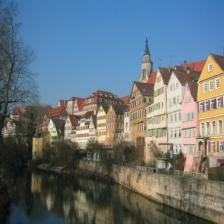

# Style Transfer experiments based on random nets

This repo combines the deep image prior paper with the neural style transfer paper to see if we can use random neural nets to get perceptually high-quality image. If it works, it will raise an important question regarding what is capturing *style* / *content* of a scene. Is it the very well trained neural network as claimed in Gatys *et al* in their 2015 paper or is it just the structure of the neural net combined with the loss metrics that are sufficient?

## current insights

... Content loss preserves the spatial information of the image. Moreover, with just one layer with few random convolutions, we can recover the content image (starting from random noise) very easily. This is as per the deep-prior paper.

... Gramian loss defined for the style loss does not contain spatial information, instead has a sort-of auto-correlation with the features themselves and as such would then favour those set of features that seem most dominant (in terms of absolute value) in the image. However, this feature (or a pair of features) may pop up at any location which is what we mean (in part) when we say we want to transfer style and hence, works as a good style loss measure.

... However, to capture styles at various length-scales of the style image, we may take cues from the texture synthesis paper of Gatys et. al and implement a multi-scale shallow net or use the idea from deep prior paper and use a deeper net.

## To do

1. I will try both ideas and report on what works best.
2. Quantify how good is the reconstruction (PSNR)

## Done

Reconstruction works very well, with just the SSE loss amongst the final non-linear features.

## Update

As with all things in deep learning, it turns out [He *et al*](https://arxiv.org/abs/1606.04801) have already published results with random deep CNNs doing exactly what I am trying in this repo. In fact, these results are much better than my attempts, hence, I will read their report and update on what they do different than what I thought.

## Results with pretrained VGG

## Results with random VGG

-- these results do not represent the power of the method. I was just lazy to get good results from this as it involves a lot of hyperparameter tuning which is not very interesting.
